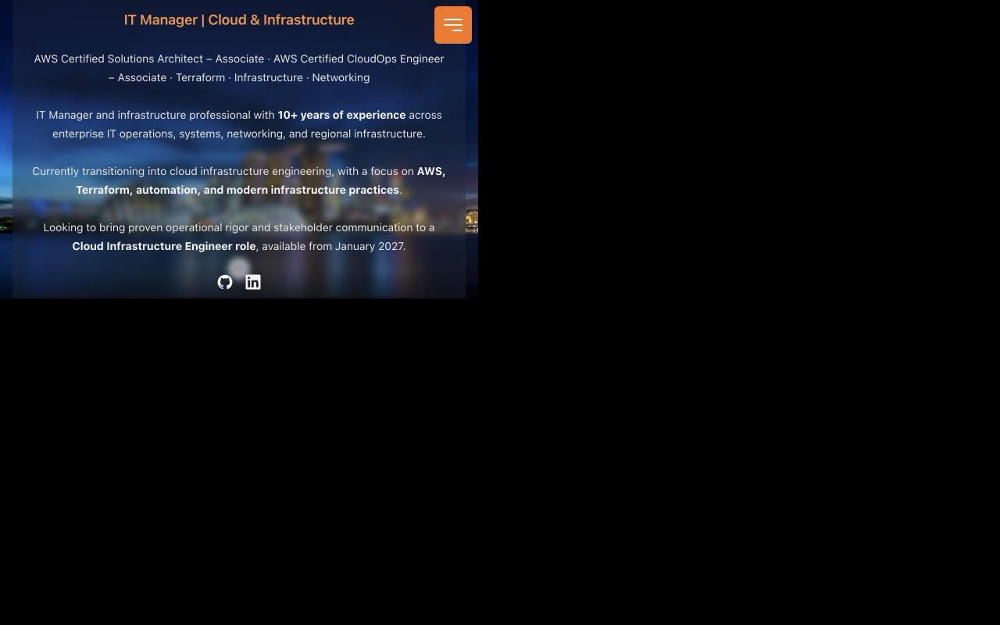
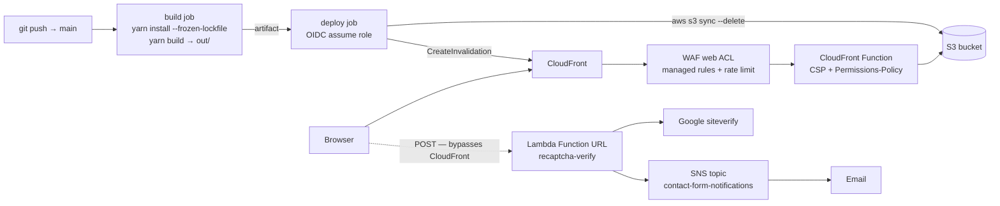

# cloud-resume

Personal resume site for **[ongyiktatt.com](https://ongyiktatt.com)**.

The site is a **static export** — there is no Next.js server at runtime. Everything that
serves HTTP is AWS: CloudFront in front of an S3 bucket, protected by WAF and a
security-headers policy, with a Lambda function as the only dynamic endpoint. The site is
built and shipped entirely from GitHub Actions.



## AWS infrastructure

| Resource               | Identifier / configuration                                                                  |
| ---------------------- | ------------------------------------------------------------------------------------------- |
| Account / region       | `<ACCOUNT_ID>` / `ap-southeast-1` (CloudFront + its WAF ACL are global / `us-east-1`)         |
| S3 bucket              | `ongyiktatt.com-<account>-ap-southeast-1-an` — holds the exported site                       |
| CloudFront distribution | `EXXXXXXXXXXXXX` — custom domain `ongyiktatt.com`, origin = the S3 bucket                    |
| Security headers       | managed `Managed-SecurityHeadersPolicy` + CloudFront Function `prod-resume-response-headers` |
| WAF web ACL            | `CreatedByCloudFront-<suffix>`, scope `CLOUDFRONT`                                            |
| Lambda function        | `recaptcha-verify` — `nodejs24.x`, 1024 MB, 15 s timeout                                     |
| Lambda Function URL    | public (`AuthType: NONE`) with CORS restricted to the site origin                            |
| Lambda execution role  | `<LAMBDA_EXECUTION_ROLE>` + inline policy `sns-publish-contact-form`                         |
| SNS topic              | `arn:aws:sns:ap-southeast-1:<ACCOUNT_ID>:contact-form-notifications`                         |
| CI deploy role         | `<DEPLOY_ROLE_ARN>` — assumed by GitHub Actions via OIDC                                     |

Tagging convention: `environment=production` and `stack=prod-resume`.

### Request path



### CloudFront

A single default cache behaviour — no extra behaviours, no path-based routing. The origin is
the S3 bucket, `DefaultRootObject` is `index.html`, and viewers are forced to HTTPS
(`redirect-to-https`). Because the export is fully static and fingerprinted by Next.js, there
is no origin-side compute to manage.

CloudFront is also the **only** path that applies WAF rules and security headers.

### Edge security headers

The distribution serves the AWS managed security-headers policy:

- `Strict-Transport-Security: max-age=31536000`
- `X-Content-Type-Options: nosniff`
- `X-Frame-Options: SAMEORIGIN`
- `Referrer-Policy: strict-origin-when-cross-origin`
- `X-XSS-Protection: 1; mode=block`

The managed policy covers neither `Content-Security-Policy` nor `Permissions-Policy`, so a
**CloudFront Function** (`prod-resume-response-headers`, `cloudfront-js-2.0`, `viewer-response`)
adds exactly those two — deliberately *only* those two, so the headers can never be emitted
twice.

> CloudFront's `SecurityHeadersConfig` has no field for `Permissions-Policy` at all, so it
> can only ever be set by an edge function.

The CSP is strict because the export contains no inline executable scripts. It still needs
`style-src 'unsafe-inline'` (one inline `style` attribute plus reCAPTCHA-injected styles),
and it allowlists `www.google.com` / `www.gstatic.com` for the reCAPTCHA widget with the
Lambda Function URL in `connect-src`.

### WAF

The `CreatedByCloudFront-*` ACL is associated with the distribution through
`DistributionConfig.WebACLId`:

| Priority | Rule                          | Action |
| -------- | ----------------------------- | ------ |
| 0        | `AWSManagedRulesAmazonIpReputationList` | Block  |
| 1        | `AWSManagedRulesCommonRuleSet`          | Block  |
| 2        | `AWSManagedRulesKnownBadInputsRuleSet`  | Block  |
| 3        | `RateLimitPerIp` — rate-based, IP aggregate key, 300 s window, limit **1000** | Block |

Two operational notes worth remembering:

- **The rate limit does not protect the contact form.** The browser posts straight to the
  Lambda Function URL, which never passes through CloudFront.
- **WAF changes take a few minutes to propagate.** A burst fired immediately after an ACL
  update can still return `200` while the rule is already in place.

## CI/CD

`.github/workflows/main.yml` — two jobs, triggered on every push to `main`.

### Pipeline

1. **build** (`ubuntu-latest`)
   - `actions/checkout` → `actions/setup-node` with `node-version: 24`
   - `yarn install --frozen-lockfile`
   - `yarn build`, with `NEXT_PUBLIC_CONTACT_VERIFY_URL` and
     `NEXT_PUBLIC_RECAPTCHA_SITE_KEY` injected from the repository variables
     `vars.CONTACT_VERIFY_URL` and `vars.RECAPTCHA_SITE_KEY`
   - `actions/upload-artifact` publishes `out/` as the `site-build` artifact
2. **deploy** (`needs: build`, `permissions: id-token: write`)
   - `actions/download-artifact` restores `out/`
   - `aws-actions/configure-aws-credentials` assumes the deploy role
   - `aws s3 sync ./out s3://ongyiktatt.com-<account>-ap-southeast-1-an --delete`
   - `aws cloudfront create-invalidation --distribution-id EXXXXXXXXXXXXX --paths "/*"`

All actions are on their Node 24 releases (`checkout@v7`, `setup-node@v7`,
`upload-artifact@v7`, `download-artifact@v8`, `configure-aws-credentials@v6`); the older
majors still target the deprecated Node 20 runtime.

### Deployment credentials

CI holds **no long-lived AWS keys**. The deploy job requests a GitHub OIDC token and assumes
`<DEPLOY_ROLE_ARN>`, whose trust policy is scoped to
this repository and branch:

- `sub` = `repo:<owner>/cloud-resume:ref:refs/heads/main`
- `aud` = `sts.amazonaws.com`

Its inline policy (`deploy-permissions`) is least-privilege: the S3 object operations the
`sync` needs on that one bucket, plus `cloudfront:CreateInvalidation` on the distribution
only.

### What CI enforces

`yarn build` runs `tsc --build` **before** `next build`, so a type error fails the deploy
before anything reaches S3.

### Deploying the Lambda

Build the bundle and update the function:

```bash
cd aws/recaptcha-verify
rm -f /tmp/function.zip && zip -q /tmp/function.zip index.mjs
aws lambda update-function-code \
  --function-name recaptcha-verify \
  --zip-file fileb:///tmp/function.zip \
  --region ap-southeast-1
```

Build the zip in `/tmp`, not in the repo — a stray `function.zip` dirties the working tree.

Full runbook — execution role, Function URL permissions, SNS subscription confirmation and
smoke tests: [`aws/recaptcha-verify/README.md`](aws/recaptcha-verify/README.md).

### Local AWS access

The CLI authenticates with **`aws login`**, which issues short-lived credentials. Re-run
`aws login` when they expire.

## Contact form backend

The only dynamic component. The Lambda is invoked directly by the browser, so it — not
CloudFront — is what faces the internet for this path.

### Invocation flow

1. Browser POSTs `{name, email, message, token}` to the Function URL.
2. The function verifies `token` against Google's `siteverify` endpoint using the secret key.
3. It requires the verified `hostname` to be `ongyiktatt.com`. The site key is public, so
   without this check any token minted with it would be accepted.
4. It validates the fields and strips control characters from `name`/`email` before they reach
   the SNS subject line, so a crafted name cannot inject email headers.
5. It publishes to the SNS topic, which emails the subscribed address.

`{ "success": true }` is returned only when *both* the reCAPTCHA check and the SNS publish
succeed — no email is ever sent for an unsolved challenge.

### Function configuration

- **1024 MB, not 256 MB.** Memory drives CPU, and the AWS SDK import dominates cold start:
  measured end-to-end to the Function URL, 256 MB is ~1.96 s cold vs ~0.93 s at 1024 MB, with
  warm invocations around 0.08 s.
- **15 s timeout.** The 3 s default does not cover a cold start.
- **Environment:** `RECAPTCHA_SECRET_KEY` and `SNS_TOPIC_ARN` only. Secrets exist nowhere
  else — a static export has no server to hold them, and `NEXT_PUBLIC_*` values are public
  because they are inlined into the bundle at build time.
- **CORS lives in exactly one place:** the Function URL's `--cors` config (origins
  `https://ongyiktatt.com` and `http://localhost:3000`). The handler must never set
  `Access-Control-Allow-Origin`, or Lambda emits the header twice and browsers reject the
  response.
- A public Function URL needs **both** `lambda:InvokeFunctionUrl` and `lambda:InvokeFunction`
  resource-policy statements. Missing either returns `403 Forbidden`.

### Concurrency

Reserved concurrency is the right backstop for a public Function URL — it caps how hard the
function can be driven, independently of CloudFront and the WAF rate rule. It is not set here
yet: the account's *Concurrent executions* quota is the constraint, and raising it means going
through AWS Support. That quota bounds the function in the meantime, which is sufficient while
it is the only function in the account.

### SNS delivery

Submissions are published to `contact-form-notifications`, which has an **email**
subscription. The recipient must click **Confirm subscription** in the confirmation mail
before anything is delivered — messages published before confirmation are dropped. Check with:

```bash
aws sns list-subscriptions-by-topic \
  --topic-arn arn:aws:sns:ap-southeast-1:<ACCOUNT_ID>:contact-form-notifications \
  --region ap-southeast-1 --query 'Subscriptions[].[Endpoint,SubscriptionArn]' --output json
```

`PendingConfirmation` means it is not active yet.

## Application

Kept deliberately brief — see [`AGENTS.md`](AGENTS.md) for architecture and conventions.

- Next.js 16 (Pages Router), static export (`output: 'export'`); Turbopack is the bundler.
- Node 24 (`.nvmrc`), Yarn 1.
- `yarn dev` starts the dev server; `yarn build` type-checks and writes `out/` — the same
  artifact CI uploads.
- Content is data-driven: `src/data/data.tsx`, with types in `src/data/dataDef.ts`.

### Configuration

`NEXT_PUBLIC_*` values are inlined into the bundle at build time, so they are public. Never
put a secret in one — the reCAPTCHA secret lives only in the Lambda's environment.

| Variable                         | Required | Source                                                                         |
| -------------------------------- | -------- | ------------------------------------------------------------------------------ |
| `NEXT_PUBLIC_CONTACT_VERIFY_URL` | **yes**  | `.env.local` locally (copy `.env.example`), `CONTACT_VERIFY_URL` repo var in CI  |
| `NEXT_PUBLIC_RECAPTCHA_SITE_KEY` | no       | falls back to the public key hardcoded in `src/config.ts`                       |

The verify URL deliberately has **no fallback**: committing a live endpoint is the thing we
are avoiding, and a missing value **fails the build** rather than shipping a form that posts
nowhere.

> Use `envOrDefault()` from `src/config.ts` for public-var fallbacks rather than `??`. GitHub
> Actions substitutes an empty string for an unset repository variable, and `'' ?? fallback`
> is `''`, which would silently ship an empty reCAPTCHA site key.

`yarn lint` rewrites files (`prettier --write` + `eslint --fix`); to check without modifying,
use `yarn eslint 'src/**/*.{ts,tsx}' --max-warnings=0`.

## Credits

Built from [tbakerx/react-resume-template](https://github.com/tbakerx/react-resume-template)
(MIT). The layout and component structure originate there; the AWS infrastructure,
CI/CD pipeline and contact-form backend are specific to this site.

## License

[MIT](LICENSE)
